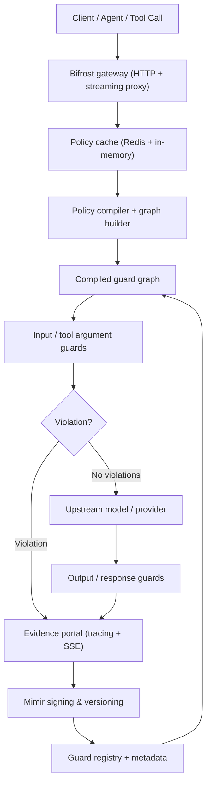

# Policy Enforcement Architecture

Heimdall unifies the Heimdall engine, the Bifröst gateway, and the Mímir control plane into a **deterministic policy enforcement stack** for agents, tool-calling workflows, streaming tokens, and every LLM surface. Policies stay data-first (YAML + combine/combinators), the gateway enforces signed graphs, and Mímir records every guard decision so you can trace how a violation or allowance happened.

## System overview

The following flowchart keeps the layout vertical so you can follow how a request moves through the stack.

The diagram emphasizes three practical flows:

1. **Agents and tools** call the gateway with `x-policy-id`. Heimdall enforces input guards (tool arguments, agent intents) before forwarding anything upstream.
2. **Output guards and streaming guards** run after the upstream model returns data, keeping the same policy graph intact to stop hallucinated content or dangerous streaming chunks.
3. **Evidence collection** happens at every decision point. Mímir signs the entire policy bundle, records guard hits, and surfaces the data through SSE (see `demo/demo.html`). That makes “Stop hallucinations” actionable, not marketing copy.

## Components

### Heimdall engine
Guards are async functions (`Guard = Callable[[Ctx], Awaitable[Either]]`) that return `Left` for violations and `Right` for success. Use builders/combinators (`seq`, `anyOf`, `lens`, etc.) to write deterministic graphs that target chat inputs, tool arguments, streaming chunks, or automation pipelines. Policies remain data, so the same graph compiles into every surface (gateway, SDK, streaming, CLI).

### Bifröst gateway
A FastAPI proxy that:
- Accepts OpenAI-compatible HTTP requests and streaming chunks.
- Loads signed policies from Redis/in-memory cache.
- Runs input, output, and streaming guards before and after hitting upstream providers.
- Streams guard metadata through `/trace` and attaches the evidence bundle to responses (`response.guardrails`).
- Proxies to OpenAI, Bedrock, Ollama, or any custom provider without changing client code.

### Mímir control plane
Signs policies (Ed25519 + SHA256), versions them, hot-reloads them, and records policy hashes for every loaded bundle. This makes the policy graph tamper-proof, shippable across environments, and traceable for compliance teams. Signed metadata is reflected in the demo evidence feed, in SSE, and in gateway logs.

### Guard packs & models
T0/T1 guards (regex, rules) run first; T2 guards are optional and plug into any runtime (ONNX, TorchScript, HTTP/LLM). The built-in metadata documents performance budgets so you can stretch from fast heuristics to heavy ML without rewriting the control plane.

### Evidence & observability
OpenTelemetry spans, profiler metrics, SSE streams (`/trace`), and guard logs capture:
- Which guard fired, its tier, and decision time.
- Policy ID, signature hash, and version recorded by Mímir.
- Evidence (masked text, violation message, reason) to explain why a tool call or chunk was blocked.

Use the demo (`demo/demo.html`) and the SSE endpoint to replay decisions for audits or retrospectives.

---

## Use cases

- **Agent orchestration:** Guard every tool argument and summarize the Mímir-signed evidence for compliance reports.
- **Streaming enforcement:** Run T0 guards on every chunk before the client consumes it.
- **Policy control plane:** Swap policies with `x-policy-id`, hot-reload signed graphs, and keep the same enforcement across gateway, SDK, and streaming proxies.
- **Self-auditing:** Capture guard metadata for each request so “Stop hallucinations” is backed by data (guard IDs, decisions, evidence).

Ready to dig deeper? Check [README](../README.md) for usage, [QUICKSTART_BIFROST.md](QUICKSTART_BIFROST.md) for setup, and [docs/GUARD_AUTHORING.md](GUARD_AUTHORING.md) for writing new policies.
